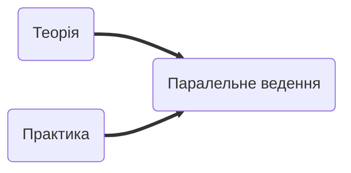
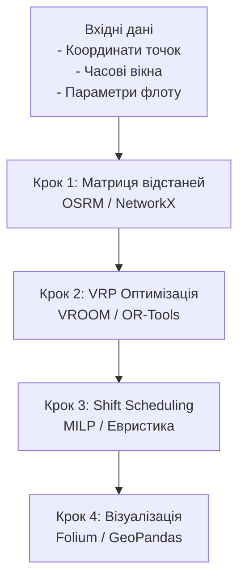

**Практичне заняття**

---

# 📌 Слайд 1. Вступ і Мотивація

## Чому графи та дерева — це фундамент?

**Реальні приклади навколо нас:**

- Google Maps знаходить найкоротший маршрут
- IDE автодоповнює код
- Netflix рекомендує фільми
- Uber оптимізує маршрути водіїв
- Amazon планує логістику складів

**Ключова ідея:** Графи та дерева — це не абстрактна математика, а **моделі реального світу**

## Цілі заняття

1. **Систематизувати** алгоритми та структури даних
2. **Розібрати** прикладні сценарії з різних доменів
3. **Імплементувати** практичні задачі
4. **Побудувати** комплексний системний проєкт
5. **Зрозуміти** архітектуру production-систем

---

# 🧭 Слайд 2. Структура Заняття

## Формат: Теорія ↔ Практика



## Етапи

1. **Базовий огляд** — Структури даних та алгоритми (Recap)
2. **Міні-задачі** — Розминка на простих прикладах
3. **Мультидоменні сценарії** — Застосування у різних галузях
4. **Deep dive** — Фокус на *вибраному* проєкті
5. **Системна архітектура** — Як це працює в production
6. **Рефлексія** — Обговорення та Q&A

**Тривалість:** 2-3 академічні години

---
# 🌳 Слайд 3. Базові Структури Даних (RECAP)

## 3.1 Графи

**Визначення:** Множина вершин (V) та ребер (E)

|Тип графу|Характеристики|Приклад|
|---|---|---|
|Неорієнтований|Ребра без напрямку|Дороги між містами|
|Орієнтований (Digraph)|Ребра з напрямком|Односторонні вулиці|
|Зважений|Ребра мають вагу|Відстані, час|
|Мультиграф|Кілька ребер між вершинами|Різні типи транспорту|

**Представлення:**

- Матриця суміжності: O(V²) пам'яті, O(1) перевірка ребра
- Список суміжності: O(V+E) пам'яті, O(degree) перевірка

## 3.2 Дерева

**Визначення:** Зв'язний ациклічний граф

|Тип дерева|Властивості|Застосування|
|---|---|---|
|Binary Tree|Макс. 2 дитини|Базова структура|
|BST|Ліворуч < корінь < праворуч|Швидкий пошук|
|AVL|Самобалансування|Гарантований O(log n)|
|B-Tree|Багато ключів на вузол|Бази даних|
|MST|Мінімальна вага|Оптимізація мереж|

## 3.3 Префіксні структури

|Структура|Складність пошуку|Пам'ять|Застосування|
|---|---|---|---|
|Trie|O(m)|O(ALPHABET × n × m)|Автодоповнення|
|Radix Tree|O(m)|Стиснутий Trie|Економія пам'яті|
|Suffix Tree|O(m)|O(n)|Пошук підрядків|

**m** — довжина ключа, **n** — кількість ключів

---

# 🧮 Слайд 4. Базові Алгоритми — Огляд (RECAP)

## 4.1 Графові алгоритми

### Обхід графу

|Алгоритм|Складність|Застосування|Структура даних|
|---|---|---|---|
|BFS|O(V+E)|Найкоротший шлях (незважений)|Queue|
|DFS|O(V+E)|Виявлення циклів, топ. сортування|Stack (рекурсія)|

### Найкоротший шлях

|Алгоритм|Складність|Від'ємні ваги|Коли використовувати|
|---|---|---|---|
|Dijkstra|O(E log V)|❌|Один старт, додатні ваги|
|Bellman-Ford|O(VE)|✅|Від'ємні ваги допустимі|
|Floyd-Warshall|O(V³)|✅|Всі пари, малі графи|
|A*|O(E) сер.|❌|З евристикою (GPS)|

### Мінімальне остівне дерево

|Алгоритм|Складність|Підхід|
|---|---|---|
|Kruskal|O(E log E)|Сортування ребер + Union-Find|
|Prim|O(E log V)|Жадібний з купою|

## 4.2 Алгоритми на Trie

|Операція|Складність|Опис|
|---|---|---|
|Insert|O(m)|Додавання слова довжиною m|
|Search|O(m)|Точний пошук|
|StartsWith|O(m)|Пошук за префіксом|
|Delete|O(m)|Видалення слова|

## 4.3 Комбінаторна оптимізація

### TSP (Travelling Salesman Problem)

|Метод|Складність|Якість|Застосування|
|---|---|---|---|
|Brute Force|O(n!)|Оптимум|n ≤ 10|
|Held-Karp (DP)|O(n²·2ⁿ)|Оптимум|n ≤ 20|
|Christofides|O(n³)|≤ 1.5× OPT|Апроксимація|
|2-opt|O(n²) ітерація|Покращення|Локальний пошук|
|Genetic Algorithm|Варіюється|Хороша|Великі n|

### VRP (Vehicle Routing Problem)

|Варіант|Обмеження|Алгоритми|
|---|---|---|
|Basic VRP|Кілька машин|Clarke-Wright|
|CVRP|+ місткість|Clarke-Wright Savings|
|VRPTW|+ часові вікна|Solomon Insertion, ALNS|
|VRPPD|+ pickup-delivery|Branch-and-Price|

---

# 💻 Слайд 5. Практичні Міні-Задачі

> [!warning]

## Розминка: 3 базові задачі

### Задача 1: Найкоротший шлях (Dijkstra)

**Умова:** Граф з 6 містами, знайти найкоротший шлях з A в F

**Інструменти:** NetworkX

**Очікуваний результат:** Шлях та його вага

---

### Задача 2: Автодоповнення (Trie)

**Умова:** Список адрес, потрібно реалізувати пошук за префіксом

**Інструменти:** Власна реалізація або datrie

**Очікуваний результат:** Всі адреси, що починаються з "Київ"

---

### Задача 3: З'єднання складів (MST)

**Умова:** 5 складів, вартості з'єднання, знайти мінімальну мережу

**Інструменти:** NetworkX (Kruskal/Prim)

**Очікуваний результат:** Оптимальне дерево та загальна вартість

---

**Формат виконання:**

- Jupyter Notebook з покроковим кодом
- Візуалізація результатів
- Аналіз складності

---

# 🌐 Слайд 6. Сценарії Застосування — Мультидоменний Огляд


> [!warning]

## Універсальність графів та дерев

**Ключова ідея:** Одні й ті самі структури вирішують проблеми у різних галузях

### Категорії застосувань

| Домен                   | Структури                          | Типові задачі                    |
| ----------------------- | ---------------------------------- | -------------------------------- |
| **Пошук та індексація** | Trie, Suffix Tree                  | Автодоповнення, full-text search |
| **Соціальні мережі**    | Social Graph                       | Рекомендації, виявлення спільнот |
| **Біоінформатика**      | De Bruijn Graph, Phylogenetic Tree | Секвенування ДНК, еволюція       |
| **NLP та лінгвістика**  | Parse Tree, FSA                    | Граматичний аналіз, токенізація  |
| **Machine Learning**    | GNN, Decision Trees                | Класифікація, прогнозування      |
| **Ігри та графіка**     | Navigation Mesh, BSP Tree          | Pathfinding, рендеринг           |
| **Робототехніка**       | RRT, Pose Graph                    | SLAM, планування руху            |
| **Бази даних**          | B-Tree, R-Tree                     | Індексація, spatial queries      |
| **Блокчейн**            | Merkle Tree, DAG                   | Верифікація, consensus           |
| **Стиснення**           | Huffman Tree                       | ZIP, JPEG compression            |
| **Знання**              | Knowledge Graph                    | Семантичний пошук, Q&A           |
| **Логістика**           | Road Network, VRP                  | Маршрутизація, оптимізація       |

**Матеріал:** Таблиці з попереднього розділу документації

---

# 📌 Слайд 7. Сценарії — Короткі Кейси (5 прикладів)

## Кейс 1: Trie у пошукових системах

**Задача:** Автодоповнення пошукових запитів у Google

**Структура:** Trie з частотами

**Алгоритм:**

1. Побудова Trie з усіх попередніх запитів
2. Зберігання частоти/популярності у вузлах
3. Пошук за префіксом + сортування за частотою

**Переваги:** O(m) пошук, де m — довжина префіксу

---

## Кейс 2: Suffix Tree у біоінформатиці

**Задача:** Пошук мутацій у геномі

**Структура:** Suffix Tree побудований за O(n) алгоритмом Ukkonen

**Застосування:**

- Пошук повторів
- Вирівнювання послідовностей
- Пошук спільних фрагментів

**Реальні проєкти:** BLAST, Illumina sequencing

---

## Кейс 3: Graph Centrality у соціальних мережах

**Задача:** Знайти інфлюенсерів у Twitter

**Метрики:**

- **Degree Centrality:** кількість фоловерів
- **Betweenness:** посередництво між групами
- **PageRank:** важливість з урахуванням якості зв'язків

**Алгоритми:** BFS/DFS + спеціалізовані метрики

---

## Кейс 4: GNN у рекомендаційних системах

**Задача:** Рекомендації товарів на Amazon

**Структура:** User-Item bipartite graph

**Підхід:**

1. Граф користувачів та товарів
2. Graph Neural Network для embeddings
3. Передбачення зв'язків (link prediction)

**Технології:** PyTorch Geometric, GraphSAGE

---

## Кейс 5: Huffman Tree у стисненні

**Задача:** Стиснення текстових файлів

**Алгоритм:**

1. Підрахунок частот символів
2. Побудова бінарного дерева (жадібно)
3. Присвоєння кодів на основі глибини

**Результат:** Часті символи → короткі коди

**Застосування:** ZIP, PNG, JPEG baseline

---

# 🚀 Слайд 8. Вибір Домену для Глибокого Розбору


## Чому логістика?

### Аргументи на користь вибору

**1. Комплексність**

- Поєднує графи, дерева, оптимізацію
- Багато різнорідних підзадач
- Реалістичні обмеження

**2. Практична цінність**

- Реальний ринок (Uber, Amazon, Nova Poshta)
- Вимірювані метрики (час, відстань, вартість)
- Відразу видно результат оптимізації

**3. Доступність інструментів**

- Open-source: OSRM, VROOM, OR-Tools
- Python ecosystem: NetworkX, GeoPandas
- Візуалізація: Folium, Leaflet

**4. Різноманітність алгоритмів**

|Підзадача|Алгоритми|
|---|---|
|Маршрутизація|Dijkstra, A*|
|Оптимізація флоту|VRP, TSP|
|Планування змін|MILP, CP|
|Прогнозування|ML (LSTM, XGBoost)|
|Автодоповнення адрес|Trie|
|Просторові запити|R-Tree, KD-Tree|

---

# 🌍 Слайд 9. Теорія для Логістичного Кейсу

## Відповідність: Алгоритм → Підзадача

### Основна таблиця

|Підзадача|Алгоритм/Структура|Роль|Складність|
|---|---|---|---|
|**Найкоротший шлях**|Dijkstra / A*|Маршрут між 2 точками|O(E log V)|
|**Матриця відстаней**|Contraction Hierarchies|Всі пари відстаней|O(log n) query|
|**Оптимізація маршрутів**|VRP (VROOM, OR-Tools)|Розподіл замовлень по машинах|NP-hard, евристики|
|**TSP**|Lin-Kernighan, GA|Обхід точок однією машиною|O(n²) + метаевристика|
|**Часові вікна**|VRPTW|Доставка в певні інтервали|Solomon Insertion|
|**Pickup-Delivery**|PDPTW|Таксі, каршеринг|Branch-and-Price|
|**Планування змін**|MILP / CP|Графіки водіїв|Integer Programming|
|**Розміщення складів**|Facility Location|Де будувати хаби|Set Cover, Local Search|
|**Кластеризація зон**|K-Means, DBSCAN|Сегментація регіонів|O(nk) ітерацій|
|**Автодоповнення адрес**|Trie|Швидкий пошук|O(m)|
|**Просторові запити**|R-Tree|Точки в радіусі|O(log n)|
|**Прогноз ETA**|XGBoost, LSTM|Час прибуття|ML training|
|**Прогноз попиту**|ARIMA, Prophet|Скільки замовлень|Time series|

---

## Деталізація ключових алгоритмів

### 1. Routing Engine Flow

```
OpenStreetMap дані
    ↓
Contraction Hierarchies (OSRM)
    ↓
Матриця відстаней/часу
    ↓
VRP Optimizer (VROOM)
    ↓
Оптимальні маршрути
```

### 2. VRP з обмеженнями

**Формулювання:**

- Мінімізувати: загальна відстань/час
- Обмеження:
    - Кожна точка відвідується рівно 1 раз
    - Capacity constraints (вага, об'єм)
    - Time windows (проміжки доставки)
    - Всі маршрути починаються/закінчуються у депо

**Підходи:**

- Clarke-Wright Savings Algorithm
- Large Neighborhood Search (LNS)
- Genetic Algorithms
- OR-Tools CP-SAT solver

### 3. Shift Scheduling

**Формулювання:**

- Мінімізувати: кількість працівників або вартість
- Обмеження:
    - Покриття всіх замовлень
    - Максимальна тривалість зміни
    - Перерви, відпочинок
    - Балансування навантаження

**Підходи:**

- Integer Programming (Gurobi, CPLEX)
- Constraint Programming (OR-Tools)
- Hungarian Algorithm (assignment)

---

# 🧪 Слайд 10. Практичний Логістичний Проєкт — Огляд

## Сценарій задачі

**Дано:**

- 3 склади (депо): Київ-Центр, Бровари, Вишневе
- 15 точок доставки по Київській області
- 3 вантажівки (різна місткість)
- Часові вікна доставки: 09:00-18:00
- Час обслуговування кожної точки: 15 хв

**Потрібно:**

1. Знайти оптимальні маршрути для кожної машини
2. Мінімізувати загальну відстань/час
3. Дотриматись часових вікон
4. Розподілити навантаження рівномірно
5. Спланувати зміни водіїв

**Метрики успіху:**

- Загальна відстань (км)
- Час виконання (год)
- Кількість використаних машин
- % дотримання часових вікон
- Завантаженість транспорту (%)

---

## Архітектура рішення

