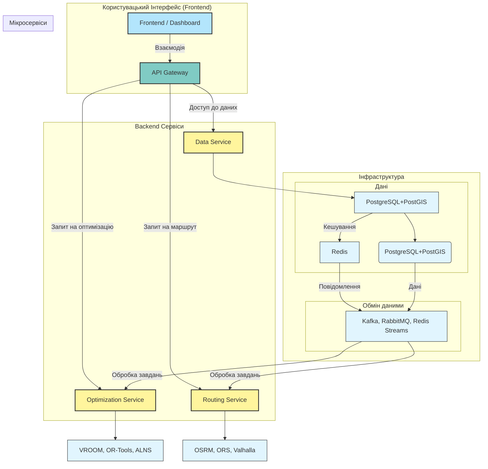

RELATED:
- [[Blended 2. Design and Analysis of Algorithms CONTENT PRESENTATION 🖼️]]

МАЙБУТНІЙ ПЛАН

- теорія контент, таблички, опис основної теорії
- паралельні базові приклади
- системний окмплексний розбір з різними сценаріями (як мінімум 1 точно практично) з  акцентом виразом різних алгоримів та технологій

---

# Логістичні задачі: Алгоритми, структури даних та технології

## 🧭 1. Класичні алгоритми 

### 1.1 Алгоритми найкоротшого шляху

| Алгоритм                          | Короткий опис                                        | Типові задачі                     | Складність                                | Особливості                                   |
| --------------------------------- | ---------------------------------------------------- | --------------------------------- | ----------------------------------------- | --------------------------------------------- |
| **Dijkstra**                      | Знаходить найкоротший шлях у графі без від'ємних ваг | Маршрут з A в B, навігація        | O(E log V) з купою Фібоначчі              | Оптимальний, базовий для навігаційних систем  |
| **A***                            | Евристичний пошук з пріоритетом                      | GPS, карти, ігри, планування руху | O(E) у середньому                         | Використовує евристику (Manhattan, Euclidean) |
| **Bellman–Ford**                  | Підтримує від'ємні ваги, виявляє від'ємні цикли      | Маршрути зі штрафами, арбітраж    | O(V·E)                                    | Повільніший, але універсальніший              |
| **Floyd–Warshall**                | Всі пари найкоротших шляхів                          | Матриці відстаней між пунктами    | O(V³)                                     | Зручно при невеликих графах (<500 вузлів)     |
| **Bidirectional Search**          | Пошук одночасно з обох кінців                        | Швидка навігація                  | O(b^(d/2))                                | Прискорює A* та Dijkstra                      |
| **Contraction Hierarchies (CH)**  | Попередня обробка графу для надшвидкого пошуку       | Навігаційні системи, OSRM         | Препроцесинг: O(n log n), Query: O(log n) | Основа OSRM, GraphHopper                      |
| __ALT (A_, Landmarks, Triangle)_* | Використання орієнтирів для евристики                | Великі мережі доріг               | Query: O(E log V)                         | Хороша альтернатива CH                        |
| **Johnson's Algorithm**           | Для всіх пар у графах з від'ємними вагами            | Складні транспортні мережі        | O(V²log V + VE)                           | Комбінує Bellman-Ford + Dijkstra              |

### 1.2 Алгоритми обходу графів

|Алгоритм|Призначення|Складність|Застосування|
|---|---|---|---|
|**BFS (Breadth-First Search)**|Пошук в ширину|O(V+E)|Найкоротший шлях у незваженому графі, рівні ієрархії|
|**DFS (Depth-First Search)**|Пошук в глибину|O(V+E)|Виявлення циклів, топологічне сортування, сильнозв'язні компоненти|
|**Iterative Deepening DFS**|DFS з обмеженням глибини|O(b^d)|Коли невідома глибина цілі|
|**Bidirectional BFS**|BFS з обох кінців|O(b^(d/2))|Швидкий пошук у великих графах|

### 1.3 Мінімальне остівне дерево (MST)

| Алгоритм                | Складність         | Коли використовувати                               |
| ----------------------- | ------------------ | -------------------------------------------------- |
| **Kruskal's Algorithm** | O(E log E)         | Розріджені графи, коли ребра можна легко сортувати |
| **Prim's Algorithm**    | O(E log V) з купою | Густі графи, інкрементальна побудова               |
| **Borůvka's Algorithm** | O(E log V)         | Паралелізація, історично перший алгоритм MST       |

---

## 🚛 2. Алгоритми комбінаторної оптимізації

### 2.1 Travelling Salesman Problem (TSP)

|Метод|Тип|Складність|Якість розв'язку|Коли використовувати|
|---|---|---|---|---|
|**Brute Force**|Точний|O(n!)|Оптимум|n ≤ 10|
|**Held–Karp (DP)**|Точний|O(n²·2ⁿ)|Оптимум|n ≤ 20-25|
|**Branch and Bound**|Точний|Експоненційний|Оптимум|n ≤ 30-40 з хорошими bounds|
|**Nearest Neighbor**|Конструктивна евристика|O(n²)|~25% гірше оптимуму|Швидкий старт, малі n|
|**Greedy / Cheapest Insertion**|Конструктивна евристика|O(n²)|~15-20% гірше|Кращий старт ніж NN|
|**Christofides Algorithm**|Апроксимація|O(n³)|≤ 1.5× оптимум|Гарантована якість для метричного TSP|
|**2-opt / 3-opt**|Локальний пошук|O(n²) / O(n³) на ітерацію|Покращує початковий розв'язок|Після конструктивної евристики|
|**Lin-Kernighan**|Локальний пошук|O(n²·⁷)|Дуже хороша якість|Один з кращих для великих n|
|**Simulated Annealing (SA)**|Метаевристика|Залежить від параметрів|Хороша якість|Універсальний, легко адаптувати|
|**Genetic Algorithms (GA)**|Метаевристика|Залежить від популяції|Хороша якість|Складні обмеження|
|**Ant Colony Optimization (ACO)**|Метаевристика|O(n²·m·t), m-мурахи, t-ітерації|Дуже хороша якість|Динамічні задачі, природна паралелізація|
|**Tabu Search**|Метаевристика|Залежить від tenure|Хороша якість|Уникає циклічності в локальному пошуку|
|**Particle Swarm Optimization**|Метаевристика|Залежить від параметрів|Середня якість|Неперервна оптимізація|

### 2.2 Vehicle Routing Problem (VRP)

|Варіант VRP|Опис|Складність|Типові алгоритми|
|---|---|---|---|
|**Basic VRP**|Кілька машин, мінімізація загальної відстані|NP-hard|Clarke-Wright, Sweep Algorithm|
|**CVRP**|Capacitated VRP - обмеження місткості|NP-hard|Clarke-Wright Savings, CW+2-opt|
|**VRPTW**|VRP з часовими вікнами|NP-hard|Solomon insertion, LNS|
|**VRPB**|VRP зBackhauls (зворотні рейси)|NP-hard|Two-phase heuristics|
|**VRPPD**|VRP з Pickup and Delivery|NP-hard|ALNS, Branch-and-Price|
|**MDVRP**|Multi-Depot VRP|NP-hard|Clustering + VRP|
|**SDVRP**|Split Delivery VRP|NP-hard|Relaxation heuristics|
|**VRPSD**|VRP зі стохастичним попитом|NP-hard|Chance-constrained programming|
|**DVRP**|Dynamic VRP (реальний час)|NP-hard|Rolling horizon, event-driven|
|**E-VRP**|Electric VRP (з підзарядкою)|NP-hard|Modified routing з recharging stations|

### 2.3 Евристики та метаевристики для VRP

|Метод|Тип|Характеристики|
|---|---|---|
|**Clarke-Wright Savings**|Конструктивна евристика|Швидка, хороша для базового VRP, O(n²)|
|**Sweep Algorithm**|Конструктивна евристика|Для задач з полярною структурою|
|**Solomon Insertion Heuristics**|Конструктивна евристика|I1 (час), I2 (відстань), створена для VRPTW|
|**Large Neighborhood Search (LNS)**|Метаевристика|Destroy-repair підхід, ефективна для великих задач|
|**Adaptive LNS (ALNS)**|Метаевристика|Автоматичний вибір операторів, state-of-the-art для VRP|
|**Variable Neighborhood Search (VNS)**|Метаевристика|Систематична зміна околів пошуку|
|**Guided Local Search (GLS)**|Метаевристика|Штрафує "погані" атрибути розв'язку|
|**Iterated Local Search (ILS)**|Метаевристика|Пертурбація + локальний пошук|
|**GRASP**|Метаевристика|Greedy Randomized + Local Search|
|**Memetic Algorithms**|Гібридна метаевристика|GA + локальний пошук = дуже ефективно|

### 2.4 Точні методи

|Метод|Призначення|Особливості|
|---|---|---|
|**Branch-and-Cut**|TSP, VRP малих розмірів|Додає cutting planes до B&B|
|**Branch-and-Price**|VRP, column generation|Ефективний для задач з багатьма змінними|
|**Constraint Programming**|Складні обмеження|OR-Tools CP-SAT solver|
|**Integer Programming (IP)**|Формулювання як MILP|Gurobi, CPLEX, CBC|
|**Benders Decomposition**|Великі задачі|Розділення на master + subproblems|

---

## 📊 3. Структури даних

### 3.1 Графові структури

|Структура|Призначення|Складність операцій|Застосування|
|---|---|---|---|
|**Adjacency Matrix**|Представлення графу|O(1) перевірка ребра, O(V²) пам'ять|Густі графи, швидкі запити|
|**Adjacency List**|Представлення графу|O(degree) перевірка ребра, O(V+E) пам'ять|Розріджені графи|
|**Edge List**|Список ребер|O(E) перебір|Алгоритми типу Kruskal|
|**Incidence Matrix**|Вершини × Ребра|O(V·E) пам'ять|Мережеві потоки|

### 3.2 Деревоподібні структури

|Структура|Пошук|Вставка|Видалення|Застосування|
|---|---|---|---|---|
|**Binary Search Tree (BST)**|O(log n) сер., O(n) гірше|O(log n) сер.|O(log n) сер.|Прості задачі сортування|
|**AVL Tree**|O(log n)|O(log n)|O(log n)|Гарантована збалансованість|
|**Red-Black Tree**|O(log n)|O(log n)|O(log n)|C++ STL map/set|
|**B-Tree / B+ Tree**|O(log n)|O(log n)|O(log n)|Бази даних, індекси на диску|
|**Segment Tree**|O(log n) запит|O(log n) оновлення|-|Range queries (сума, мін, макс)|
|**Fenwick Tree (BIT)**|O(log n)|O(log n)|-|Префіксні суми, легша імплементація|
|**Interval Tree**|O(log n + k)|O(log n)|O(log n)|Перетини інтервалів, часові вікна|

### 3.3 Геопросторові структури

|Структура|Призначення|Складність пошуку|Застосування|
|---|---|---|---|
|**KD-Tree**|k-dimensional space|O(log n) сер., O(n) гірше|Nearest neighbor, point queries|
|__R-Tree / R_-Tree_*|Прямокутники, регіони|O(log n)|GIS, spatial databases (PostGIS)|
|**Quadtree / Octree**|2D/3D просторовий поділ|O(log n)|Карти, ігри, mesh subdivision|
|**Grid Index**|Рівномірна сітка|O(1) для клітинки|Швидкі spatial joins|
|**Geohash**|Геокодування|O(1) префіксний пошук|Proximity search, Redis geospatial|
|**S2 Geometry**|Сферична геометрія|O(log n)|Google Maps, Uber, покриття Землі|

### 3.4 Префіксні та текстові структури

|Структура|Пошук|Вставка|Пам'ять|Застосування|
|---|---|---|---|---|
|**Trie (Prefix Tree)**|O(m)|O(m)|O(ALPHABET_SIZE · n · m)|Автодоповнення адрес, словники|
|**Compressed Trie (Patricia)**|O(m)|O(m)|Менше ніж Trie|Економія пам'яті|
|**Suffix Tree**|O(m)|O(n) побудова|O(n)|Пошук підрядків, genome analysis|
|**Suffix Array**|O(m log n)|O(n log n)|O(n)|Альтернатива suffix tree, менше пам'яті|
|**Aho-Corasick**|O(n + m + z)|O(m)|O(m)|Множинний pattern matching|

### 3.5 Спеціалізовані структури

| Структура                     | Призначення                        | Операції                | Застосування                    |
| ----------------------------- | ---------------------------------- | ----------------------- | ------------------------------- |
| **Union-Find (Disjoint Set)** | Компоненти зв'язності              | O(α(n)) ≈ O(1)          | Kruskal, динамічна зв'язність   |
| **Priority Queue (Heap)**     | Пріоритети                         | O(log n) insert/extract | Dijkstra, A*, event queues      |
| **Fibonacci Heap**            | Пріоритети з швидким decrease-key  | O(1) amort. decrease    | Оптимізований Dijkstra          |
| **Bloom Filter**              | Імовірнісна перевірка належності   | O(k)                    | Фільтрація запитів, кеші        |
| **Skip List**                 | Імовірнісна збалансована структура | O(log n) сер.           | Redis sorted sets               |
| **Hash Table**                | Швидкий пошук                      | O(1) amort.             | Кешування, індекси              |
| **LRU Cache**                 | Кеш з витісненням                  | O(1) get/put            | Кешування розрахунків маршрутів |
|                               |                                    |                         |                                 |

---

## 🧰 4. Бібліотеки та фреймворки

### 4.1 Python

|Бібліотека|Призначення|Ключові можливості|
|---|---|---|
|**NetworkX**|Графи, базові алгоритми|Dijkstra, BFS/DFS, MST, TSP heuristics, централізація|
|**graph-tool**|Високопродуктивні графи (C++)|Швидше NetworkX, великі графи, візуалізація|
|**igraph**|Графи, мережевий аналіз|Швидкий, R/Python/C інтерфейси|
|**OR-Tools**|Оптимізація (Google)|VRP, TSP, CP-SAT, routing, scheduling|
|**PuLP**|Linear Programming|MILP формулювання, різні солвери|
|**Pyomo**|Математичне програмування|Flexible MILP/MINLP, optimization modeling|
|**Gurobi / CPLEX**|Комерційні оптимізаційні солвери|Найшвидші MILP солвери, академічні ліцензії|
|**SCIP**|Open-source MINLP solver|Безкоштовна альтернатива Gurobi|
|**GeoPandas**|Геопросторові дані|Spatial operations на Pandas|
|**Shapely**|Геометричні операції|Points, lines, polygons manipulation|
|**OSRM-py**|Обгортка для OSRM API|Маршрутизація, матриці відстаней|
|**Folium**|Інтерактивні карти|Leaflet.js wrapper, візуалізація маршрутів|
|**scikit-learn**|Machine Learning|Кластеризація (K-means, DBSCAN), класифікація|
|**scipy.spatial**|Просторові алгоритми|KD-Tree, distance matrices, Voronoi|

### 4.2 Routing Engines (Open Source)

|Інструмент|Мова|Швидкість|VRP|Навігація|Особливості|
|---|---|---|---|---|---|
|**OSRM**|C++|⚡⚡⚡|❌ (TSP only)|⭐⭐|Contraction Hierarchies, найшвидший|
|**OpenRouteService**|Java|⚡⚡|✅ (VROOM)|⭐⭐⭐|Isochrones, багато профілів, easy setup|
|**Valhalla**|C++|⚡⚡|❌|⭐⭐⭐⭐|Realistic turn-by-turn, matrix routing|
|**VROOM**|C++|⚡⚡⚡|✅✅✅|❌|VRP optimizer, працює з OSRM/ORS/Valhalla|
|**GraphHopper**|Java|⚡⚡|✅|⭐⭐⭐|Гнучка маршрутизація, commercial+open|
|**Routino**|C|⚡|❌|⭐⭐|Легкий, планувальник OpenStreetMap|

### 4.3 Оптимізаційні платформи

|Платформа|Тип|Переваги|Застосування|
|---|---|---|---|
|**OptaPlanner**|Java|Constraint programming, VRP|Виробничі системи, планування|
|**HeuristicLab**|C#/.NET|Метаевристики, GA|Дослідження, benchmarking|
|**jMetal**|Java|Multi-objective optimization|Багатокритеріальна оптимізація|
|**DEAP**|Python|Evolutionary algorithms|GA, GP, evolutionary strategies|
|**pymoo**|Python|Multi-objective optimization|NSGA-II, MOEA/D|
|**LocalSolver**|Комерційний|Hybrid solver|Складні комбінаторні задачі|

### 4.4 GIS та картографічні системи

| Система       | Тип             | Можливості                        |
| ------------- | --------------- | --------------------------------- |
| **QGIS**      | Desktop GIS     | Безкоштовний, плагіни для routing |
| **ArcGIS**    | Desktop GIS     | Комерційний, Network Analyst      |
| **PostGIS**   | Spatial DB      | PostgreSQL extension, topology    |
| **H3**        | Uber Geospatial | Hexagonal hierarchical indexing   |
| **Turf.js**   | JavaScript      | Geospatial analysis у браузері    |
| **deck.gl**   | JavaScript      | Візуалізація великих геоданих     |
| **Kepler.gl** | Web             | Інтерактивна гео-візуалізація     |

---

## 🏗️ 5. Типові класи логістичних задач

### 5.1 Основні класи

|Клас задач|Абревіатура|Складність|Типові алгоритми|Реальні приклади|
|---|---|---|---|---|
|**Shortest Path**|SP|P (polynomial)|Dijkstra, A*|GPS навігація|
|**Travelling Salesman**|TSP|NP-hard|Held-Karp, LKH, GA|Обхід точок продажу|
|**Vehicle Routing**|VRP|NP-hard|Clarke-Wright, ALNS|Доставка товарів|
|**VRP з часовими вікнами**|VRPTW|NP-hard|Solomon, LNS|Курєрські служби|
|**Pickup and Delivery**|PDP / PDPTW|NP-hard|ALNS, Branch-Price|Таксі, каршеринг|
|**Multi-Depot VRP**|MDVRP|NP-hard|Clustering + VRP|Мережа складів|
|**Dynamic VRP**|DVRP|NP-hard|Rolling horizon|Реальний час (Uber, Glovo)|
|**Inventory Routing**|IRP|NP-hard|MILP, metaheuristics|Vendor Managed Inventory|
|**Location Routing**|LRP|NP-hard|Two-phase heuristics|Розміщення складів + маршрути|
|**Arc Routing**|ARP|NP-hard|Rural Postman, Chinese Postman|Прибирання вулиць, читання лічильників|

### 5.2 Спеціалізовані варіанти

|Варіант|Особливості|Галузь|
|---|---|---|
|**Green VRP**|Мінімізація викидів CO₂|Еко-логістика|
|**E-VRP (Electric)**|Станції зарядки, обмежений запас ходу|Електромобілі|
|**Drone Delivery**|3D routing, обмеження батареї|Amazon Prime Air|
|**Last-Mile Delivery**|Міська логістика, паркування|E-commerce|
|**Humanitarian Logistics**|Надзвичайні ситуації, пріоритети|Допомога при катастрофах|
|**Cold Chain**|Температурний режим|Продукти, фармацевтика|
|**Hazmat Routing**|Небезпечні вантажі, обмеження маршрутів|Хімічна промисловість|
|**School Bus Routing**|Pickup + dropoff, часові вікна|Шкільні автобуси|

---

## 🌍 6. Спеціалізовані алгоритми

### 6.1 Мережеві потоки

|Алгоритм|Складність|Застосування|
|---|---|---|
|**Ford-Fulkerson**|O(E · max_flow)|Максимальний потік|
|**Edmonds-Karp**|O(V · E²)|Max flow з BFS|
|**Dinic's Algorithm**|O(V² · E)|Швидший max flow|
|**Push-Relabel**|O(V² · E)|Max flow з preflow|
|**Min-Cost Max-Flow**|O(V² · E · log V)|Потік з мінімальною вартістю|
|**Hungarian Algorithm**|O(n³)|Assignment problem (призначення)|

### 6.2 Покриття та упаковка

|Задача|Складність|Алгоритми|Застосування|
|---|---|---|---|
|**Set Cover**|NP-hard|Greedy (log n apx)|Розміщення складів, покриття регіонів|
|**Facility Location**|NP-hard|Local search, MILP|Де будувати розподільчі центри|
|**Knapsack**|NP-hard|DP, Branch-Bound|Завантаження вантажівки|
|**Bin Packing**|NP-hard|First Fit, Best Fit|Паллети, контейнери|
|**Cutting Stock**|NP-hard|Column generation|Розкрій матеріалів|

### 6.3 Планування (Scheduling)

|Задача|Нотація|Алгоритми|Застосування|
|---|---|---|---|
|**Job Shop Scheduling**|J||Cmax|
|**Flow Shop**|F||Cmax|
|**Parallel Machines**|P||Cmax|
|**Shift Scheduling**|-|MILP, CP|Графіки змін персоналу|
|**Nurse Rostering**|-|CP, metaheuristics|Лікарні, склади|

---

## 📈 7. Machine Learning для логістики

### 7.1 Прогнозування

|Завдання|Методи|Бібліотеки|
|---|---|---|
|**Прогноз попиту**|ARIMA, Prophet, LSTM|statsmodels, Prophet, TensorFlow|
|**ETA (час прибуття)**|Gradient Boosting, Deep Learning|XGBoost, LightGBM, PyTorch|
|**Прогноз трафіку**|Graph Neural Networks|PyTorch Geometric, DGL|
|**Динамічне ціноутворення**|Reinforcement Learning|Stable-Baselines3, RLlib|

### 7.2 Кластеризація та сегментація

|Алгоритм|Застосування|
|---|---|
|**K-Means**|Сегментація клієнтів, зон доставки|
|**DBSCAN**|Виявлення щільних регіонів|
|**Hierarchical Clustering**|Таксономія маршрутів|
|**HDBSCAN**|Кластеризація зі змінною щільністю|

### 7.3 Reinforcement Learning

|Підхід|Застосування|
|---|---|
|**Q-Learning / DQN**|Динамічна маршрутизація|
|**Policy Gradient (PPO, A3C)**|Стратегії прийняття рішень|
|**Multi-Agent RL**|Координація флоту|

---

## 🔄 8. Реальні системи та інтеграції

### 8.1 Розподілені обчислення

|Технологія|Призначення|
|---|---|
|**Apache Spark**|Batch processing великих графів|
|**Apache Flink**|Streaming routing у реальному часі|
|**Kafka**|Event streaming для DVRP|
|**Redis**|Кешування матриць відстаней, geospatial queries|
|**Celery**|Розподілені задачі оптимізації|

### 8.2 Контейнеризація та оркестрація

|Інструмент|Застосування|
|---|---|
|**Docker**|Ізоляція OSRM, VROOM, ORS|
|**Docker Compose**|Локальний стек маршрутизації|
|**Kubernetes**|Production deployment, масштабування|

---

## 💡 9. Практичні рекомендації

### 9.1 Вибір алгоритму за розміром задачі

| Кількість точок | TSP                 | VRP                          | Підхід                      |
| --------------- | ------------------- | ---------------------------- | --------------------------- |
| < 10            | Brute force         | Greedy                       | Просто й швидко             |
| 10-20           | Held-Karp           | Clarke-Wright                | Точний або хороша евристика |
| 20-50           | Christofides, 2-opt | Solomon insertion            | Швидкі евристики            |
| 50-200          | LKH, GA             | ALNS                         | Метаевристики               |
| 200-1000        | LKH                 | VROOM, OR-Tools              | Спеціалізовані рішення      |
| 1000+           | Parallel GA         | Parallel ALNS, cluster-first | Розподілені обчислення      |

### 9.2 Типовий технологічний стек

### 9.3 Метрики оцінки якості розв'язку

|Метрика|Формула|Пояснення|
|---|---|---|
|**Total Distance**|Σ(dist)|Загальна пройдена відстань|
|**Total Time**|Σ(time + service_time)|Час з урахуванням обслуговування|
|**Vehicle Count**|count(vehicles)|Кількість використаних машин|
|**Utilization**|load / capacity|Завантаженість транспорту|
|**Service Level**|delivered / total|% доставлених замовлень|
|**Time Window Violations**|count(late_arrivals)|Порушення часових обмежень|
|**Gap to Optimal**|(solution - lower_bound) / lower_bound|% відхилення від оптимуму|

---

## 📚 10. Додаткові алгоритми та техніки

### 10.1 Інші графові алгоритми

|Алгоритм|Призначення|Складність|
|---|---|---|
|**Topological Sort**|Впорядкування залежностей|O(V+E)|
|**Strongly Connected Components (SCC)**|Виявлення циклів, зв'язність|O(V+E) (Tarjan/Kosaraju)|
|**Articulation Points / Bridges**|Критичні вузли/ребра|O(V+E)|
|**Eulerian Path/Circuit**|Обхід всіх ребер один раз|O(E)|
|**Hamiltonian Path/Circuit**|Обхід всіх вершин (NP-complete)|Експоненційний|
|**PageRank**|Важливість вузлів|O(V+E) на ітерацію|
|**Betweenness Centrality**|Центральність вузла|O(V·E) (всі пари)|
|**Community Detection**|Кластери у графах|Louvain: O(V log V)|
|**Maximum Matching**|Паросполучення|O(E√V) (Hopcroft-Karp)|
|**Graph Coloring**|Розфарбування (NP-complete)|Greedy, backtracking|

### 10.2 Апроксимаційні алгоритми

|Алгоритм|Задача|Гарантія якості|
|---|---|---|
|**Christofides**|Metric TSP|≤ 1.5× OPT|
|**Greedy Set Cover**|Set Cover|≤ ln(n)× OPT|
|**2-approximation MST**|Metric TSP|≤ 2× OPT|
|**PTAS (Polynomial Time Approximation Scheme)**|Euclidean TSP|(1+ε)× OPT|

### 10.3 Online алгоритми

|Алгоритм|Задача|Competitive Ratio|
|---|---|---|
|**Greedy Online TSP**|Dynamic TSP|O(log n)|
|**Online Matching**|Ride-sharing|1-1/e ≈ 0.63|
|**Ski Rental**|Динамічні рішення buy vs rent|2|

---

## 🎓 11. Benchmarking та Dataset

### 11.1 Популярні benchmark задачі

|Benchmark|Тип|Розмір|Джерело|
|---|---|---|---|
|**TSPLIB**|TSP|14-85900 міст|Heidelberg University|
|**CVRPLIB**|CVRP|5-1000+ customers|NEO Research Group|
|**Solomon Instances**|VRPTW|100 customers|Marius Solomon|
|**Gehring & Homberger**|VRPTW|200-1000 customers|Extended Solomon|
|**Li & Lim Instances**|PDPTW|100+ requests|Pickup-Delivery|
|**Uchoa Instances**|CVRP|Large-scale|CVRP benchmark|

### 11.2 Датасети реальних даних

| Dataset                         | Тип             | Опис                      |
| ------------------------------- | --------------- | ------------------------- |
| **OpenStreetMap**               | Road network    | Глобальна мережа доріг    |
| **NYC Taxi Dataset**            | Pickup-delivery | Реальні поїздки таксі     |

---

## 🔬 12. Дослідницькі напрямки

### 12.1 Сучасні тренди

|Напрямок|Опис|Інструменти|
|---|---|---|
|**Learning to Optimize**|ML для покращення евристик|GNN, Transformers, RL|
|**Neural Combinatorial Optimization**|Нейронні мережі для TSP/VRP|Attention mechanisms, Pointer Networks|
|**Quantum Optimization**|QAOA для комбінаторних задач|Qiskit, D-Wave|
|**Federated Optimization**|Розподілена оптимізація без централізації|Federated Learning|
|**Multi-Modal Logistics**|Інтеграція різних видів транспорту|Hybrid routing|

---
---

## ✅ Висновки та рекомендації

### Для початківців:

1. Почніть з **NetworkX** для розуміння графів
2. Вивчіть **Dijkstra** та **A*** для пошуку шляхів
3. Спробуйте прості **TSP евристики** (Nearest Neighbor, 2-opt)
4. Використовуйте **OR-Tools** для перших VRP задач

### Для просунутих:

1. Імплементуйте **ALNS** або **LNS**
2. Інтегруйте **OSRM + VROOM**
3. Додайте **ML для прогнозування** (попит, ETA)
4. Побудуйте **real-time систему** з Kafka/Redis

### Для production:

1. **Горизонтальне масштабування** через Kubernetes
2. **Кешування** розрахунків (Redis, Memcached)
3. **Моніторинг** (Prometheus, Grafana)
4. **A/B тестування** алгоритмів
5. **Fallback стратегії** при збоях

---

Цей документ тепер містить **повний спектр** алгоритмів, структур даних, технологій та практичних рекомендацій для розробки логістичних систем від прототипу до production.

---

# 🌍 Застосування графів, дерев та префіксних структур поза логістикою

---

## 🔍 1. Інформаційний пошук, індексація та автодоповнення

### 1.1 Пошукові системи

|Структура|Застосування|Приклад|
|---|---|---|
|**Trie**|Автодоповнення запитів|Google Suggest, DuckDuckGo|
|**Inverted Index + Trie**|Швидкий пошук документів|Elasticsearch, Apache Solr|
|**Suffix Array**|Повнотекстовий пошук|grep, документообіг|
|**DAWG**|Стиснені словники|Morphology analyzers|

**Алгоритми:**

- Побудова Trie: O(n·m), де n - слова, m - середня довжина
- Пошук за префіксом: O(m)
- Aho-Corasick: пошук множини патернів O(n + m + z)

**Реальні кейси:**

- IDE автодоповнення (VSCode, IntelliJ)
- Spell-checkers (Grammarly, LanguageTool)
- DNS резолвери (швидкий lookup доменів)

### 1.2 Системи рекомендацій

|Структура|Застосування|
|---|---|
|**Bipartite Graph**|User-Item рекомендації (Netflix, Amazon)|
|**Knowledge Graph**|Context-aware recommendations|
|**Collaborative Filtering Graph**|Схожість користувачів/товарів|

**Алгоритми:**

- Random Walk with Restart
- PageRank-based scoring
- Graph embeddings (node2vec, GraphSAGE)

---

## 👥 2. Соціальні мережі та комунікації

### 2.1 Аналіз соціальних графів

|Задача|Алгоритм|Застосування|
|---|---|---|
|**Виявлення інфлюенсерів**|Centrality (degree, betweenness, eigenvector)|Маркетинг, PR|
|**Виявлення спільнот**|Louvain, Girvan-Newman, Label Propagation|Сегментація аудиторії|
|**Виявлення ботів/фейків**|Graph anomaly detection|Security, Facebook|
|**Link prediction**|Common neighbors, Adamic-Adar|Friend suggestions|
|**Cascade analysis**|BFS, влияние розповсюдження|Viral marketing|

**Метрики:**

- **Degree Centrality**: скільки зв'язків
- **Betweenness**: скільки шляхів проходить через вузол
- **PageRank**: важливість вузла (Google, Twitter)
- **Clustering Coefficient**: щільність локальних зв'язків

**Приклади:**

- Facebook Friend Graph
- LinkedIn connections
- Twitter follower network
- Reddit communities

### 2.2 Комунікаційні мережі

|Мережа|Графова модель|Оптимізація|
|---|---|---|
|**Інтернет (BGP)**|AS-граф|Shortest path routing|
|**Телефонні мережі**|Call graph|Bandwidth allocation|
|**P2P мережі**|Overlay network|DHT, Chord protocol|
|**CDN**|Distribution tree|Cache placement|

**Алгоритми:**

- Bellman-Ford для BGP
- Network flow для bandwidth
- MST для multicast routing

---

## 🧬 3. Біоінформатика та обробка послідовностей

### 3.1 Геномний аналіз

|Задача|Структура|Алгоритм|
|---|---|---|
|**Вирівнювання послідовностей**|Suffix Tree/Array|Ukkonen O(n)|
|**Збірка геному**|De Bruijn Graph|Eulerian path|
|**Пошук мутацій**|Trie з варіантами|Pattern matching|
|**Філогенетичні дерева**|Phylogenetic Tree|UPGMA, Neighbor-Joining|
|**RNA secondary structure**|Tree structure|Nussinov algorithm|

**Реальні проекти:**

- Human Genome Project
- BLAST (Basic Local Alignment Search Tool)
- Illumina sequencing pipelines
- CRISPR target finding

### 3.2 Молекулярна біологія

|Застосування|Граф|Алгоритми|
|---|---|---|
|**Білкові взаємодії**|Protein-protein interaction graph|Community detection|
|**Метаболічні шляхи**|Metabolic network|Network flow, path finding|
|**Структура ДНК**|Double helix topology|Graph coloring|

---

## 🗣️ 4. Лінгвістика та NLP

### 4.1 Обробка природної мови

|Задача|Структура|Застосування|
|---|---|---|
|**Токенізація**|Trie|Швидкий word splitting|
|**Морфологічний аналіз**|FSA/FST (Finite State Automata)|Stemming, lemmatization|
|**Синтаксичний розбір**|Parse Tree|Граматичний аналіз|
|**Dependency parsing**|Dependency Tree|Semantic analysis|
|**Word embeddings**|Word co-occurrence graph|Word2Vec preprocessing|

**Приклади:**

- Grammarly (граматика + стиль)
- Google Translate (parse trees)
- GPT tokenization (BPE with Trie)
- spaCy dependency parsing

### 4.2 Семантичні мережі

|Структура|Проект|Призначення|
|---|---|---|
|**WordNet**|Semantic graph|Синоніми, гіпоніми|
|**ConceptNet**|Common sense knowledge|Q&A системи|
|**FrameNet**|Frame semantics|Semantic role labeling|

---

## 🧮 5. Стиснення даних та кодування

### 5.1 Алгоритми стиснення

|Алгоритм|Структура|Складність|Застосування|
|---|---|---|---|
|**Huffman Coding**|Binary tree|O(n log n)|ZIP, JPEG baseline|
|**Arithmetic Coding**|Interval tree concept|O(n)|JPEG 2000, video|
|**LZ77/LZ78**|Trie/Dictionary|O(n)|gzip, PNG|
|**LZW**|Trie|O(n)|GIF, Unix compress|
|**Burrows-Wheeler**|Suffix array|O(n)|bzip2|

**Комбінації:**

- DEFLATE = LZ77 + Huffman (ZIP, PNG)
- LZMA = LZ + Range coding (7-Zip)

### 5.2 Error correction codes

|Код|Структура|Застосування|
|---|---|---|
|**Hamming codes**|Binary tree|RAM, storage|
|**Reed-Solomon**|Polynomial rings|CD, QR codes|
|**LDPC**|Sparse graph|5G, WiFi|

---

## 🧠 6. Machine Learning та AI

### 6.1 Graph Neural Networks (GNN)

|Архітектура|Застосування|
|---|---|
|**GCN (Graph Convolutional)**|Node classification|
|**GraphSAGE**|Inductive learning, великі графи|
|**GAT (Graph Attention)**|Attention mechanism на графах|
|**GIN (Graph Isomorphism)**|Graph classification|

**Реальні кейси:**

- Молекулярна хімія (drug discovery)
- Fraud detection (фінансові мережі)
- Recommendation systems
- Traffic prediction (Google Maps)

### 6.2 Дерева рішень та ансамблі

|Модель|Структура|Переваги|
|---|---|---|
|**Decision Tree**|Binary tree|Інтерпретованість|
|**Random Forest**|Ensemble of trees|Висока точність|
|**Gradient Boosting (XGBoost, LightGBM)**|Sequential trees|State-of-the-art для табличних даних|
|**Isolation Forest**|Random trees|Anomaly detection|

### 6.3 Кластеризація та embeddings

|Метод|Графова основа|
|---|---|
|**Hierarchical Clustering**|Dendrogram tree|
|**MST-based clustering**|Minimum spanning tree|
|**DBSCAN**|Density-connected graph|
|**node2vec**|Random walks на графі|
|**DeepWalk**|Skip-gram на графових walks|

---

## 🧪 7. Knowledge Graphs та семантичний пошук

### 7.1 Граф знань

|Проект|Розмір|Призначення|
|---|---|---|
|**Google Knowledge Graph**|Мільярди трійок|Search enhancement|
|**Wikidata**|100M+ entities|Structured Wikipedia|
|**DBpedia**|6M+ entities|Wikipedia extraction|
|**YAGO**|10M+ entities|Semantic web|

**Запити:**

- SPARQL (RDF graphs)
- Cypher (Neo4j)
- Gremlin (TinkerPop)

### 7.2 Онтології

|Онтологія|Галузь|
|---|---|
|**Gene Ontology**|Біологія|
|**SNOMED CT**|Медицина|
|**Schema.org**|Веб-розмітка|
|**FOAF**|Соціальні мережі|

---

## 🕹️ 8. Комп'ютерна графіка та ігри

### 8.1 Pathfinding у іграх

|Алгоритм|Коли використовувати|
|---|---|
|**A***|Grid-based maps, tile games|
|**Dijkstra**|Weighted graphs, multi-target|
|**Jump Point Search**|Grid optimization (швидше A*)|
|**Hierarchical Pathfinding**|Великі світи (RTS, MMO)|
|**Navigation Mesh**|3D worlds (Unreal, Unity)|
|**Flow Fields**|RTS з багатьма юнітами|

**Ігрові движки:**

- Unity NavMesh
- Unreal Navigation System
- Recast & Detour

### 8.2 Графіка та рендеринг

|Структура|Застосування|
|---|---|
|**BSP Tree**|Doom, Quake visibility|
|**Octree**|3D space partitioning|
|**Quadtree**|LOD (Level of Detail), terrain|
|**BVH (Bounding Volume Hierarchy)**|Ray tracing acceleration|
|**Scene Graph**|3D engines (transforms hierarchy)|

---

## 🤖 9. Робототехніка та автономні системи

### 9.1 Планування руху

|Алгоритм|Тип|Застосування|
|---|---|---|
|**RRT (Rapidly-exploring Random Trees)**|Sampling-based|High-dimensional spaces|
|**PRM (Probabilistic Roadmap)**|Multi-query|Статичні середовища|
|__A_ на occupancy grid_*|Grid-based|2D навігація роботів|
|__D_ Lite_*|Incremental|Динамічні перешкоди|
|**Hybrid A***|Grid + curves|Паркування авто|

### 9.2 SLAM (Simultaneous Localization and Mapping)

|Компонент|Структура|
|---|---|
|**Pose graph**|Graph optimization|
|**Feature map**|KD-tree для найближчих точок|
|**Loop closure**|Graph-based constraint|

**Фреймворки:**

- ROS Navigation Stack
- ORB-SLAM
- Google Cartographer

---

## 🗄️ 10. Бази даних та індексація

### 10.1 Індекси в СУБД

|Структура|СУБД|Особливості|
|---|---|---|
|**B-Tree**|PostgreSQL, MySQL|Збалансоване дерево, O(log n)|
|**B+ Tree**|InnoDB, SQL Server|Листя зв'язані списком|
|**R-Tree**|PostGIS|Spatial data|
|**GiST (Generalized Search Tree)**|PostgreSQL|Універсальна структура|
|**Hash Index**|Redis, PostgreSQL|O(1), лише equality|
|**Trie**|Redis (sorted sets prefix)|Range queries|

### 10.2 NoSQL графові БД

|База даних|Модель|Query language|
|---|---|---|
|**Neo4j**|Property graph|Cypher|
|**TigerGraph**|Native parallel|GSQL|
|**ArangoDB**|Multi-model|AQL|
|**DGraph**|Distributed|GraphQL|
|**Amazon Neptune**|Cloud|Gremlin, SPARQL|

---

## 🔗 11. Блокчейн та розподілені системи

### 11.1 Структури в блокчейні

|Структура|Блокчейн|Призначення|
|---|---|---|
|**Merkle Tree**|Bitcoin|Верифікація транзакцій|
|**Patricia Merkle Trie**|Ethereum|State storage|
|**DAG (Directed Acyclic Graph)**|IOTA, Nano|Альтернатива блокам|
|**Sparse Merkle Tree**|Plasma, rollups|Light clients|

### 11.2 Consensus графи

|Алгоритм|Структура|
|---|---|
|**Nakamoto Consensus**|Longest chain (tree)|
|**GHOST**|Tree with heavier subtrees|
|**DAG-based consensus**|Tangle, Hashgraph|

---

## 🧮 12. Обчислювальна математика

### 12.1 Symbolic computation

|Система|Структура|Застосування|
|---|---|---|
|**Mathematica**|Expression tree|Символьна математика|
|**SymPy**|AST (Abstract Syntax Tree)|Python symbolic|
|**Maxima**|Lisp S-expressions|CAS|

### 12.2 Диференціювання та оптимізація

|Концепція|Графова репрезентація|
|---|---|
|**Computational Graph**|TensorFlow, PyTorch|
|**Automatic Differentiation**|Dual numbers, tape|
|**Expression DAG**|Common subexpression elimination|

---

## 🧭 13. Планування та workflow

### 13.1 Task scheduling

|Система|Структура|Застосування|
|---|---|---|
|**Apache Airflow**|DAG|Data pipelines|
|**Prefect**|DAG|Modern workflows|
|**Temporal**|Workflow graph|Durable execution|
|**Kubernetes Jobs**|Dependency graph|Container orchestration|

### 13.2 Build systems

|Система|Граф|
|---|---|
|**Make**|Dependency DAG|
|**Bazel**|Build graph|
|**Gradle**|Task graph|
|**Webpack**|Module dependency graph|

---

## 🧠 14. Концептуальне моделювання та знання

### 14.1 Освітні системи

|Структура|Застосування|
|---|---|
|**Concept Maps**|Навчальні матеріали|
|**Curriculum Graph**|Learning paths|
|**Prerequisite Tree**|Course dependencies|

### 14.2 Наукові онтології

|Галузь|Структура|
|---|---|
|**Філософія**|Causal graphs, concept networks|
|**Когнітивна наука**|Semantic networks|
|**Інженерія знань**|Ontology graphs|

---

## 📊 Підсумкова таблиця застосувань

| Категорія            | Ключові структури            | Типові задачі               |
| -------------------- | ---------------------------- | --------------------------- |
| **Пошук**            | Trie, Suffix Tree            | Автодоповнення, індексація  |
| **Соціальні мережі** | Social Graph                 | Рекомендації, спільноти     |
| **Біоінформатика**   | De Bruijn, Phylogenetic Tree | Секвенування, еволюція      |
| **NLP**              | Parse Tree, FSA              | Розбір мови, морфологія     |
| **Стиснення**        | Huffman Tree                 | ZIP, multimedia             |
| **ML**               | GNN, Decision Trees          | Класифікація, прогнозування |
| **Знання**           | Knowledge Graph              | Q&A, семантичний пошук      |
| **Ігри**             | Navigation Mesh, BSP         | Pathfinding, рендеринг      |
| **Робототехніка**    | RRT, Pose Graph              | SLAM, планування руху       |
| **БД**               | B-Tree, R-Tree               | Індексація, spatial queries |
| **Блокчейн**         | Merkle Tree, DAG             | Верифікація, consensus      |
| **Workflow**         | Task DAG                     | Оркестрація, збірка         |

---

Ця структура покриває **практично всі major domains** де використовуються графи, дерева та префіксні структури. Готово для інтеграції в навчальний модуль.