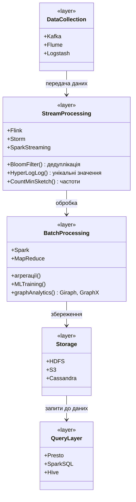
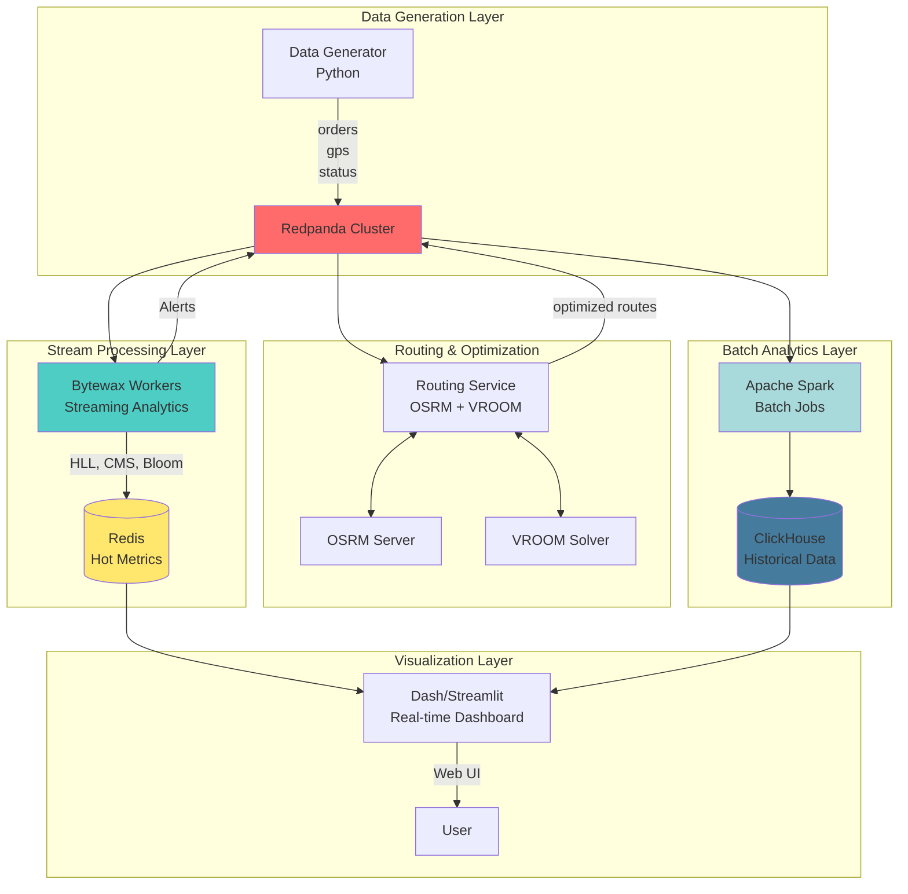

RELATED:
- [[Blended 3. Big Data and Parallel Algorithms CONTENT PRESENTATION 🖼️]]
- [[Randomized Algorithms]]
- [[MapReduce and Distributed Computing]]
- [[Swarm Intelligence MOC]]

---

# Алгоритми для великих даних та паралельні обчислення

##  1. Алгоритми для потокових даних (Streaming & Probabilistic)

Ці алгоритми розроблені для обробки даних, які надходять безперервним потоком і не можуть бути збережені повністю через обмеження пам'яті (Volume) та високу швидкість (Velocity).

| Алгоритм                                       | Призначення                                                             | Ключова ідея                                                                 | Складність (Пам'ять/Час)           | Типові задачі                                        |
| ---------------------------------------------- | ----------------------------------------------------------------------- | ---------------------------------------------------------------------------- | ---------------------------------- | ---------------------------------------------------- |
| **[[Фільтр Блума (Bloom Filter)]]**            | Імовірнісна перевірка належності елемента до множини                    | Бітовий масив та `k` хеш-функцій                                             | Пам'ять: O(1), Час: O(k)           | Перевірка кешу, фільтрація URL, уникнення дублікатів |
| **[[HyperLogLog Algorithm]]**                  | Оцінка кількості унікальних елементів (cardinality)                     | Хешування та аналіз початкових нулів (leading zeros)                         | Пам'ять: O(log log N), Час: O(1)   | Лічильники унікальних відвідувачів (Redis, Google)   |
| **[[Count-Min Sketch]]**                       | Оцінка частоти елементів у потоці                                       | Матриця лічильників та `d` хеш-функцій                                       | Пам'ять: O(d·w), Час: O(d)         | Аналіз трафіку, трендові теми в соцмережах           |
| **[[Reservoir Sampling]]**                     | Випадкова вибірка `k` елементів з потоку невідомої довжини              | Алгоритм R: зберігає `k` елементів, замінюючи їх з певною ймовірністю        | Пам'ять: O(k), Час: O(N)           | A/B тестування, вибірка даних для аналізу            |
| **[[Misra-Gries Algorithm (Frequent Items)]]** | Знаходження "важких" елементів (heavy hitters)                          | Асоціативний масив лічильників обмеженого розміру `k`                        | Пам'ять: O(k), Час: O(N)           | Популярні продукти, DDoS-атаки                       |
| **[[Locality-Sensitive Hashing (LSH)]]**       | Пошук схожих елементів у великих наборах (approximate nearest neighbor) | Хеш-функції, що з високою ймовірністю створюють колізії для схожих елементів | Залежить від параметрів            | Пошук дублікатів зображень, рекомендації, плагіат    |
| **Sliding Window Algorithms**                  | Обчислення агрегацій у часових вікнах                                   | Використання черги (deque) для підтримки вікна                               | Пам'ять: O(window_size), Час: O(N) | Моніторинг в реальному часі, аналіз біржових даних   |

---

## 🎲 2. Рандомізовані алгоритми та структури даних

Використання випадковості для досягнення хорошої середньої продуктивності, уникнення найгірших випадків та спрощення алгоритмів.

### 2.1 Рандомізовані структури даних

| Структура                       | Аналог                     | Призначення                                       | Складність (сер.) | Особливості                                      |
| ------------------------------- | -------------------------- | ------------------------------------------------- | ----------------- | ------------------------------------------------ |
| **[[Skip List]]**               | Збалансоване дерево (AVL)  | Швидкий пошук, вставка, видалення                 | O(log n)          | Проста імплементація, природний паралелізм       |
| **[[Treap (Tree + Heap)]]**      | Збалансоване дерево (RB)   | Зберігає властивості дерева пошуку та купи         | O(log n)          | Випадкові пріоритети для балансування            |
| **[[Cuckoo Hashing]]**          | Hash Table (chaining)      | Гешування з O(1) пошуком у найгіршому випадку     | O(1)              | Дві хеш-функції, переміщення елементів при колізіях |
| **[[Universal Hashing]]**       | Фіксована хеш-функція      | Сім'я хеш-функцій для мінімізації колізій          | -                 | Теоретична основа для ефективного гешування      |

### 2.2 Рандомізовані алгоритми для сортування та графів

| Алгоритм                                       | Тип        | Складність             | Призначення                                            |
| ---------------------------------------------- | ---------- | ---------------------- | ------------------------------------------------------ |
| **[[Randomized QuickSort]]**                   | Las Vegas  | O(n log n) сер., O(n²) | Сортування, уникнення найгіршого випадку               |
| **[[Randomized QuickSelect]]**                 | Las Vegas  | O(n) сер., O(n²)       | Пошук k-го елемента                                    |
| **[[Karger's Algorithm]]**                     | Monte Carlo| O(V²)                  | Пошук мінімального розрізу графу (min-cut)             |
| **[[Random Walk Algorithms]]**                 | Monte Carlo| Залежить від графу     | Ранжування вузлів (PageRank), тестування зв'язності    |
| **[[Wilson's Algorithm]]**                     | Monte Carlo| O(V³)                  | Генерація випадкового остовного дерева (uniform spanning tree) |

### 2.3 Рандомізація в машинному навчанні

| Метод                             | Категорія                 | Основна ідея                                            |
| --------------------------------- | ------------------------- | ------------------------------------------------------- |
| **[[Stochastic Gradient Descent (SGD)]]** | Оптимізація               | Оновлення ваг на основі одного або кількох випадкових прикладів |
| **[[Random Forest]]**             | Ансамблеве навчання       | Побудова "лісу" з багатьох незалежних випадкових дерев рішень |
| **[[Genetic Algorithms]]**        | Еволюційна оптимізація    | Випадкові мутації та кросинговер для пошуку рішень      |
| **[[Simulated Annealing]]**       | Метаевристика             | Дозволяє "погані" кроки з певною ймовірністю для виходу з локальних мінімумів |

---

##  3. Основи паралельних обчислень

Розділення великої задачі на менші підзадачі, які виконуються одночасно на кількох процесорах для прискорення обчислень.

### 3.1 Ключові концепції

| Термін                    | Опис                                                                         |
| ------------------------- | ---------------------------------------------------------------------------- |
| **Прискорення (Speedup)** | `S(p) = T(1) / T(p)`, де `p` - кількість процесорів. Показує, у скільки разів швидше |
| **Ефективність (Efficiency)** | `E(p) = S(p) / p`. Ідеально `E(p) = 1` (100%). Показує, наскільки добре використовуються процесори |
| **Закон Амдала**          | `S(p) = 1 / ((1-f) + f/p)`, де `f` - частка, що паралелізується. Теоретичне обмеження прискорення |
| **Закон Густафсона**      | Прискорення для задач, розмір яких зростає з кількістю процесорів (масштабоване прискорення) |
| **Синхронізація**         | Координація паралельних процесів для забезпечення коректності даних (бари, м'ютекси) |
| **Стан гонитви (Race Condition)** | Непередбачуваний результат через некоординований доступ до спільних ресурсів |

### 3.2 Моделі паралельних обчислень

| Модель                                  | Основна ідея                                                               | Синхронізація                          | Комунікація                              | Типові задачі                                       |
| --------------------------------------- | -------------------------------------------------------------------------- | -------------------------------------- | ---------------------------------------- | --------------------------------------------------- |
| **[[MapReduce]]**                       | Обробка даних у два етапи: `Map` та `Reduce`                               | Неявна, між етапами                    | Через розподілену файлову систему (HDFS) | Batch-обробка, лог-аналіз, індексація (ETL)         |
| **[[Bulk Synchronous Parallel (BSP)]]** | Ітерації (суперетапи): обчислення -> комунікація -> синхронізація (бар'єр) | Явна, глобальна (бар'єр)               | Прямий обмін повідомленнями              | Ітеративні алгоритми на графах (PageRank, SSSP)     |
| **[[Actor Model]]**                     | Незалежні "актори", що обмінюються повідомленнями                          | Асинхронна, відсутність спільних даних | Асинхронні повідомлення                  | Високонавантажені системи, real-time (Akka, Erlang) |
| [[MPI (Message Passing Interface)]]     | Низькорівневий стандарт для обміну повідомленнями                          | Явна, ручна (send/receive)             | Прямий обмін повідомленнями              | Наукові обчислення (HPC), симуляції                 |

---

##  4. Алгоритми в моделі MapReduce

Класична модель для пакетної обробки великих обсягів даних, популяризована Google.

| Задача                           | Map-фаза                                                  | Reduce-фаза                                                | Застосування                               |
| -------------------------------- | --------------------------------------------------------- | ---------------------------------------------------------- | ------------------------------------------ |
| **[[Word Count]]**               | `(doc_id, text) -> [(word, 1), (word, 1), ...]`           | `(word, [1,1,1,...]) -> (word, sum)`                        | Основа для аналізу тексту                  |
| **[[Inverted Index]]**           | `(doc_id, text) -> [(word, doc_id), ...]`                 | `(word, [d1,d2,...]) -> (word, unique_list_of_docs)`        | Пошукові системи                           |
| **[[External Merge Sort]]**      | Розбиває дані на частини, сортує кожну частину            | Зливає відсортовані частини в один фінальний потік        | Сортування даних, що не вміщаються в RAM   |
| **[[PageRank (MapReduce)]]**     | `(page, links) ->` розсилає частку свого рангу сусідам    | `(page, [rank_shares]) ->` сумує отримані частки, оновлює ранг | Ранжування веб-сторінок                    |
| **[[k-Means Clustering (MapReduce)]]** | Для кожної точки знаходить найближчий центр (кластер)   | Для кожного кластера обчислює новий центр (середнє)       | Кластеризація великих даних                |
| **[[TF-IDF Computation]]**       | Крок 1: Підрахунок TF. Крок 2: Підрахунок DF.            | Крок 3: Об'єднання TF та DF для розрахунку TF-IDF.        | Аналіз важливості слів у документах        |

---

## 5. Алгоритми в моделі BSP (Pregel)

Модель, оптимізована для ітеративних графових алгоритмів. Кожна вершина є "обчислювальним агентом".

| Задача                                  | Обчислення на вершині (Superstep N)                            | Повідомлення сусідам                                      | Умова зупинки                                         |
| --------------------------------------- | -------------------------------------------------------------- | --------------------------------------------------------- | ----------------------------------------------------- |
| **[[PageRank (BSP)]]**                  | Розраховує свій новий ранг на основі отриманих повідомлень     | Розсилає `rank / degree` кожному сусіду                   | Фіксована кількість ітерацій або збіжність рангів     |
| **Connected Components (BSP)**          | Оновлює свій ID компоненти на мінімальний з отриманих          | Розсилає свій ID компоненти сусідам                       | Жодна вершина не змінює свій ID протягом ітерації     |
| **Shortest Path (SSSP, Bellman-Ford)**  | Оновлює свою відстань до джерела, якщо отримано коротший шлях | Розсилає `свою_відстань + вага_ребра` сусідам             | Жодна вершина не оновлює свою відстань                |
| **[[Triangle Counting (BSP)]]**         | Для кожної пари сусідів перевіряє, чи є між ними ребро         | Надсилає список своїх сусідів усім сусідам                | Одна ітерація (або кілька, залежно від реалізації)    |
| **[[Label Propagation (BSP)]]**         | Обирає найпопулярніший "лейбл" серед отриманих від сусідів     | Розсилає свій поточний "лейбл" усім сусідам               | Лейбли вершин стабілізуються                        |

---

##  6. Сучасні фреймворки та їх концепції

| Фреймворк                       | Ключова концепція                                      | Модель обчислень                                        | Переваги                                                        |
| ------------------------------- | ------------------------------------------------------ | ------------------------------------------------------- | --------------------------------------------------------------- |
| **[[Apache Spark]]**            | **RDD/DataFrame/Dataset** (відмовостійка розподілена колекція) | **DAG (Directed Acyclic Graph)**, ледачі обчислення    | Швидкість (in-memory), універсальність (SQL, Streaming, ML)     |
| **Apache Flink**                | **DataStream API** (справжній стрімінг)                | Streaming-first, обробка подій "одна за одною"          | Низькі затримки, точна семантика обробки (exactly-once)         |
| **Apache Kafka**                | **Distributed Log** (події як незмінний лог)           | Pub/Sub, event streaming                                | Надійність, масштабованість, інтеграція з Flink/Spark           |

### Порівняння Apache Spark, MPI та BSP

| Критерій         | Apache Spark                               | MPI                                       | BSP                                           |
| ---------------- | ------------------------------------------ | ----------------------------------------- | --------------------------------------------- |
| **Рівень абстракції** | Високий (API для колекцій)              | Низький (пряме управління процесами)      | Середній (суперетапи, обмін повідомленнями)   |
| **Відмовостійкість** | Вбудована (через RDD/DAG)                | Відсутня (програміст відповідальний)       | Обмежена, залежить від реалізації             |
| **Простота**     | Легко почати, складніші внутрішні механізми | Складно, багато ручного коду              | Простіше за MPI, складніше за Spark           |
| **Застосування** | ETL, ML, аналітика, графові задачі         | HPC, наукові симуляції, щільні обчислення | Ітеративні графові алгоритми                  |
| **Синхронізація** | Неявна, між стадіями DAG                   | Явна, блокуюча/неблокуюча (Send/Recv)     | Глобальна, бар'єрна                           |

---

##  Висновки та практичні рекомендації

### Коли що використовувати?

| Задача                                                     | Рекомендований підхід                                                                | Інструменти                        |
| ---------------------------------------------------------- | ------------------------------------------------------------------------------------ | ---------------------------------- |
| **Підрахунок унікальних юзерів на сайті в реальному часі** | [[HyperLogLog]]                                                                      | Redis, Spark Streaming             |
| **Фільтрація вже бачених новин у стрічці**                 | [[Фільтр Блума (Bloom Filter)]]                                                      | Guava, власна реалізація           |
| **Пакетна обробка терабайтів логів (ETL)**                 | [[MapReduce]] або його еволюція                                                      | Apache Spark, Hadoop MapReduce     |
| **Аналіз зв'язків у соціальній мережі (пошук спільнот)**   | [[Bulk Synchronous Parallel (BSP)]] (Label Propagation) або графові бібліотеки Spark | Apache Giraph, Spark GraphX, Neo4j |
| **Вибірка 1% транзакцій для аналізу шахрайства**           | [[Reservoir Sampling]]                                                               | Власна реалізація в Spark/Flink    |
| **Побудова пошукового індексу для корпоративного сайту**   | [[Inverted Index]] через [[MapReduce]]                                               | Apache Spark, Elasticsearch        |
| **Висококонкурентна система (напр. онлайн-аукціон)**       | [[Actor Model]]                                                                      | Akka (Scala/Java), Erlang/Elixir   |
|                                                            |                                                                                      |                                    |

---

##   Практичні застосування та архітектури

###  Вибір алгоритму за сценарієм

|Задача|Алгоритм|Чому|
|---|---|---|
|**Unique visitors (website)**|HyperLogLog|1.5 KB для мільярдів користувачів|
|**Top-10 search queries**|Count-Min Sketch + Heap|Постійна пам'ять, точні top-k|
|**Cache що відвідали URL**|Bloom Filter|Швидка перевірка, false positives OK|
|**Random sample з Twitter stream**|Reservoir Sampling|Рівномірний розподіл, невідомий розмір|
|**Near-duplicate detection**|LSH (MinHash)|Sub-linear пошук схожих|
|**Heavy hitter IPs (DDoS)**|Misra-Gries або CMS|Виявлення аномалій у реальному часі|
|**PageRank на великому графі**|BSP (Giraph) або Spark GraphX|Vertex-centric паралелізм|
|**Log analysis**|MapReduce або Spark|Batch processing великих логів|
|**Real-time fraud detection**|Flink + Bloom/CMS|Low latency streaming|
|**A/B testing sampling**|Reservoir або Weighted Random|Fair random assignment|

###  Типовий стек для Big Data

###  Метрики ефективності

|Метрика|Streaming|Batch|
|---|---|---|
|**Throughput**|Мільйони events/сек|TB/година|
|**Latency**|Мілісекунди|Хвилини-години|
|**Пам'ять**|Fixed (probabilistic structures)|Залежить від розміру даних|
|**Точність**|Approximate (ε, δ)|Exact|

---

##  Python Libraries

|Бібліотека|Алгоритми|Use Case|
|---|---|---|
|**pyprobables**|Bloom, CMS, HLL|Probabilistic structures|
|**datasketch**|LSH, MinHash, HLL|Similarity search|
|**streamhist**|Streaming histograms|Distribution estimation|
|**scipy.stats**|Random sampling|Statistical methods|
|**numpy.random**|RNG, sampling|Scientific computing|
|**dask**|Parallel computing|Pandas-like parallel|
|**pyspark**|Spark API|Big data processing|
|**faust**|Stream processing|Kafka Streams-like|

---

