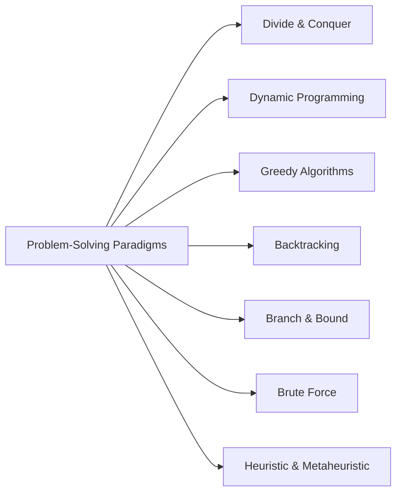

`#algorithms #problem-solving #MOC`

**DESC**: Нижче дається систематизований огляд основних типів підходів до побудови алгоритмів — з короткими поясненнями, прикладами, таблицями та схемами 👇

---

## 🧭 **1. Жадібні алгоритми (Greedy Algorithms)**

**Ідея:**
На кожному кроці обираємо **локально найкраще рішення**, сподіваючись, що воно приведе до глобального оптимуму.

**Ключ:** простота й швидкість, але не завжди гарантують оптимальний результат.

**Приклади:**
* Алгоритм Крускала / Пріма для MST
* Задача про здачу решти (класичний приклад)
* Huffman coding (жадібне злиття вузлів)

**Плюси:** прості, швидкі, часто дають оптимум.
**Мінуси:** не працюють для задач, де локальний вибір не веде до глобального оптимуму.

---

## 🧮 **2. Динамічне програмування (Dynamic Programming)**

**Ідея:**
Розбиваємо задачу на **перекривні підзадачі**, обчислюємо кожну один раз і запам'ятовуємо (memoization / bottom-up), комбінуючи результати.

**Ключ:** глобальна оптимізація через рекурсивну структуру + кеш.

**Приклади:**
* Рюкзак (Knapsack)
* Редагування рядків (Levenshtein distance)
* LIS (Longest Increasing Subsequence)
* Матриця найкоротших шляхів (Floyd–Warshall)

**Плюси:** дають точний оптимум.
**Мінуси:** часто займають багато пам’яті та часу (O(n²) і більше).

---

## 🌳 **3. Divide and Conquer (Розділяй і володарюй)**

**Ідея:**
Розбиваємо задачу на **незалежні** підзадачі, розв’язуємо кожну окремо (часто рекурсивно), і комбінуємо результат.

**Відмінність від DP:** підзадачі **не перекриваються**, тому не потрібне кешування.

**Приклади:**
* Merge Sort, Quick Sort
* Бінарний пошук
* Алгоритм Карацуби для множення
* FFT (швидке перетворення Фур’є)

**Плюси:** елегантні, масштабуються добре.
**Мінуси:** не всі задачі легко розбити на незалежні частини.

---

## 🔁 **4. Пошук із поверненням (Backtracking)**

**Ідея:**
Рекурсивно будуємо рішення, **повертаючись назад**, коли розуміємо, що гілка не веде до розв’язку.

**Ключ:** перебір з розумним «відсіканням» непотрібних шляхів.

**Приклади:**
* N-Queens
* Sudoku solver
* Генерація перестановок, комбінацій
* DFS з backtrack у пошуку шляху

**Плюси:** дає всі можливі рішення, гнучкий.
**Мінуси:** експоненційний у гіршому випадку.

---

## 🌌 **5. Branch and Bound (Гілки та межі)**

**Ідея:**
Покращення backtracking: ми **оцінюємо нижню/верхню межу** для кожної часткової гілки й **відкидаємо** ті, що не можуть дати кращий результат.

**Ключ:** використовує евристики для обрізання гілок.

**Приклади:**
* Задача комівояжера (TSP)
* Integer Linear Programming
* Knapsack з евристикою

**Плюси:** може істотно зменшити кількість перебору.
**Мінуси:** потребує гарних оцінок меж, у гіршому випадку все одно експоненційний.

---

## 🧠 **6. Евристичні та метаевристичні алгоритми**

**Ідея:**
Замість точного оптимуму шукаємо **добре наближене рішення** за прийнятний час. Часто імітують природні або фізичні процеси.

**Підвиди:**
* **Локальні пошуки:** Hill climbing, Simulated annealing
* **Популяційні:** Genetic algorithms, Ant colony, PSO
* **Жадібно+рандомні:** GRASP

**Приклади:**
* TSP з генетичними алгоритмами
* Машинне навчання (оптимізація функцій втрат)
* Оптимізація розкладів

**Плюси:** масштабуються, часто дають хороші рішення для NP-складних задач.
**Мінуси:** не гарантують оптимуму, результати залежать від параметрів.

---

## 🧰 **7. Brute Force (Перебір)**

**Ідея:**
Просто перевіряємо **всі можливі варіанти** й вибираємо найкращий.

**Приклади:**
* Повний перебір паролів
* Задача комівояжера з n! перестановками
* Knapsack без оптимізації

**Плюси:** завжди дає правильну відповідь.
**Мінуси:** непридатний для великих n (експоненційний).

---

## 📌 Порівняльна таблиця

| Підхід                  | Оптимальність     | Швидкодія       | Тип задач                 | Приклади                  |
| ----------------------- | ----------------- | --------------- | ------------------------- | ------------------------- |
| Жадібний                | Не завжди         | 🔹 Швидкий      | Локальні вибори → оптимум | MST, Huffman              |
| Динамічне програмування | ✅ Завжди          | ⚠️ Повільний    | Перекривні підзадачі      | Knapsack, LIS, Floyd      |
| Divide & Conquer        | ✅ (якщо коректно) | 🔹 Добра        | Незалежні підзадачі       | Merge sort, Binary search |
| Backtracking            | ✅                 | ❌ Експоненційна | Комбінаторні              | N-Queens, Sudoku          |
| Branch & Bound          | ✅                 | ⚠️ Залежить     | Оптимізаційні             | TSP, ILP                  |
| Евристики               | ❌ (наближено)     | 🔸 Швидкий      | Великі, NP-hard           | GA, Annealing, ACO        |
| Brute force             | ✅                 | ❌ Дуже повільно | Будь-які (але маленькі n) | Повний перебір            |

---

## 🧭 Структура парадигм (MOC)

---

## 🧠 Ключові ідеї та зв’язки

* Paradigms ≠ конкретні алгоритми → це **шаблони мислення**.
* Їх часто комбінують, наприклад:
	* Greedy + DP → оптимізація розкладів або шляхів
	* Backtracking + Branch&Bound → ефективний перебір у комбінаторних задачах
	* Heuristic + Local Search → гібридні метаевристики
* Divide & Conquer vs DP — різниця в перекриванні підзадач.
* Евристики особливо корисні для NP-hard задач, де точні методи занадто повільні.

---

## 📚 Пов’язане

* [[Algorithm Design Techniques]]
* [[Optimization Problems Overview]]
* [[Complexity Classes and NP-Hardness]]
* [[Algorithm Comparison Table]]
* [[Search and Optimization Strategies]]
